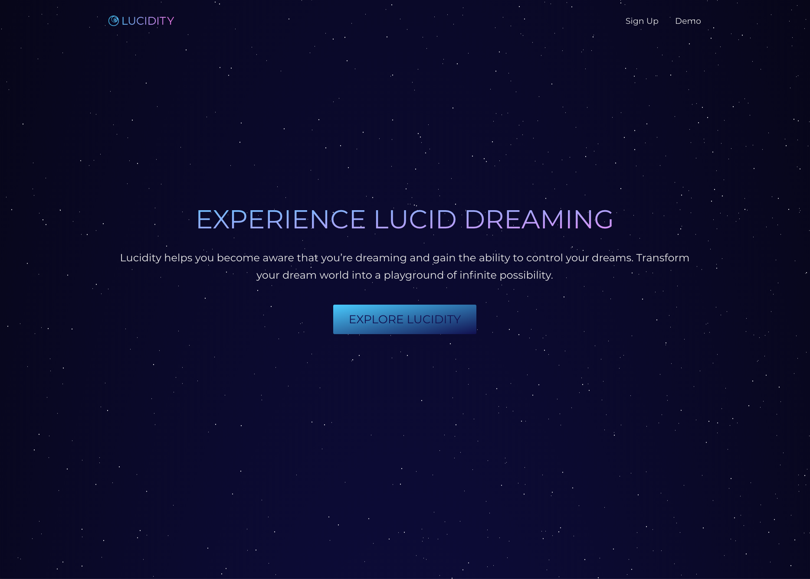

# Lucidity

### Introduction
Lucidity is an experimental React application that allows users to document their dreams and track sleeping patterns with statistical data with the intention of helping users become lucid dreamers. *(A lucid dream is a dream during which the dreamer is aware of dreaming. During this event, the dreamer may be able to exert some degree of control over the characters, narrative, and environment.)*

### How it Works
The key to lucid dreaming is to consistently document one's dreams so that patterns are easily recognized while dreaming. Lucidity provides users with a quick and simple interface that helps them keep track of what they're dreaming about and provides interactive charts and personalized statistics to help measure progress.

## Getting Started
### Installing
Clone the repository and download dependencies.
```
$ git clone https://github.com/peter-minho-kim/lucidity.git
$ cd lucidity
$ npm install
```

### Launching
Start the development server.
```
$ npm run dev-server
```
This will automatically open a new browser window with the project.

### Testing
Run tests with Jest and Enzyme.
```
$ npm run test
```

## Built With

 - [Chart.js](https://www.chartjs.org/)
 - [CSS3](https://developer.mozilla.org/en-US/docs/Web/CSS/CSS3)
 - [React](https://reactjs.org/)
 - [Redux](https://redux.js.org/)
 - [Moment.js](https://momentjs.com/)
 - [Webpack](https://webpack.js.org/)

## License
This project is licensed under the MIT License.

## Acknowledgments
### Code
- [Pure CSS Parallax Pixel Stars](http://codepen.io/Glucio/pen/BoLWPo)
- [Fade in Animations](http://animista.net)

### Images
- [Confidentiality](https://thenounproject.com/search/?q=confidentiality&creator=4000347&i=2009550)
- [Easy](https://thenounproject.com/term/easy/2036017/)
- [Fibonacci](https://thenounproject.com/search/?q=fibonacci&i=1751844)
- [Sigma](https://thenounproject.com/term/sigma/766084/)
- [Sleep](https://thenounproject.com/search/?q=sleep&creator=15063&i=935846)
- [Spiral](https://thenounproject.com/term/spiral/570356/)
- [Stars](https://thenounproject.com/term/stars/58181/)
- [Think](https://thenounproject.com/search/?q=think&i=866027)
